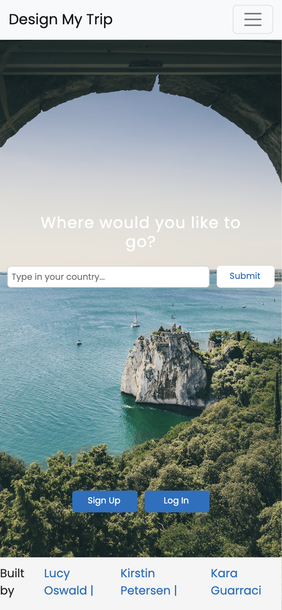
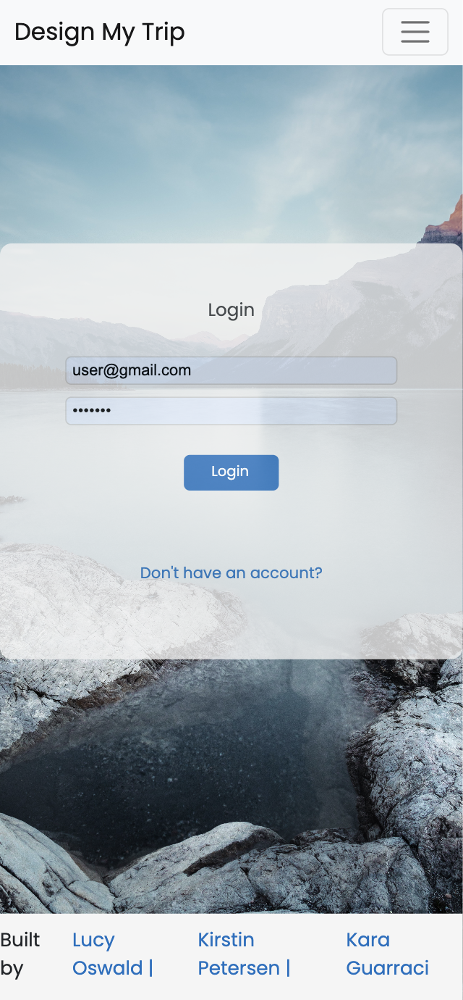
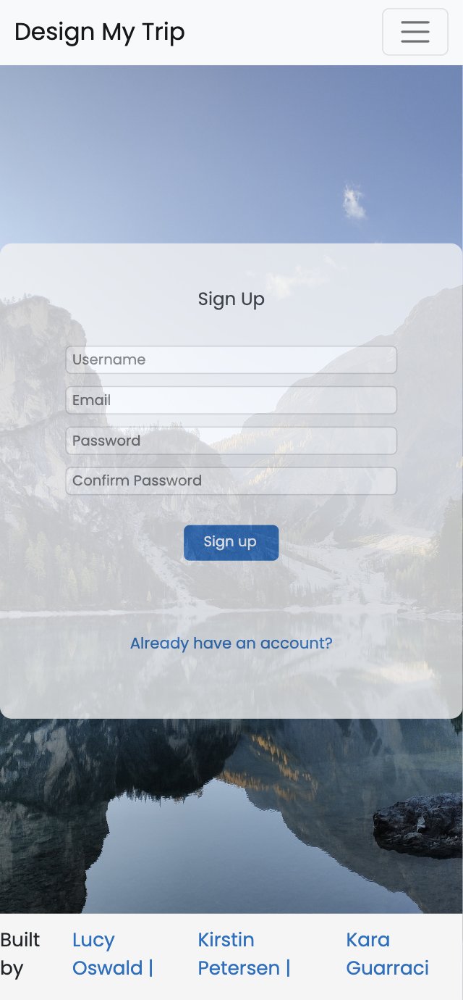

# Design My Trip

As a group of three, over a two-week period, we built a full-stack web and mobile application with CRUD functionality, using the MERN stack. Our project was a travel planning site that let users view a list of countries, select a country and then create an itinerary from the listed activities. Users can also add additional activities and update any activities that they previously added, as well as remove an activity from their itinerary.

This repo contains code for the back end client api only. Code for the back end api can be found [here](https://github.com/kpetersen04/Travel-API).

Check out the live [Design My Trip](https://designmytrip.netlify.app) site.

You can login with the details below:  
Username: user@gmail.com  
Password: 1234567

## Application Visuals


<p align="center">


</p>
<p align="center">


</p>

## Mobile Visuals

<p align="center">



</p>

<p align="center">


</p>

## Tech Stack

- Front end: JavaScript, React, React Router Dom, Axios, HTML, CSS, Sass, Bootstrap
- Back end: Node.js, Express.js, MongoDB, Mongoose, MongoDBAtlas, JSON Web Token (JWT),
- Production: Npm, Git/GitHub, Slack, Excalidraw, Postman, Jira, Mongo Atlas, Render, Netlify

## Installation Instructions

Front end

- Clone this repo
- Install dependencies with command: npm i
- Run mongoose in your computers terminal with the command mongos

Back end

- Clone this repo
- Run command: npm i
- Start server with the terminal command: npm run dev

## Project Overview

### The Brief

- Build a full-stack application by making your own backend and your own frontend
- Use an Express API to serve your data from a Mongo database
- Consume your API with a separate front-end, built with React
- Be a complete product with multiple relationships and CRUD functionality for different models
- Implement thoughtful user stories/wireframe
- Have a visually impressive design
- Be deployed online
- Completed within a two week period

### Stage One: Planning

Our group spent the first day of the project planning.

We started out using Excalidraw to create a wireframe of what the final application would like from the frontend. As well as helping us to visualize our final application, it helped to confirm the required work and establish some stretch goals we would try to pursue if we had additional time.


We also took some time to plan the content required for all our Schemas and make sure we understood how they would interconnect within the application.


I recommended that we use Jira as a project management tool to ensure that we were able to keep track of remaining work as well as prevent team members from doing duplicate work during the project weeks. Before we started working, I updated Jira with all the backend tasks we thought we might need to do and we ended the first day by selecting a few items to complete each. We then reconvened during the week to checkin and assign the remaining tasks out.

Once the majority of the backend was completed, I wrote out the key tasks we would need to complete for the frontend and added them to Jira. During a group session, we chatted through them to ensure I had included everything and then we assigned out tasks so it was clear what people needed to complete.


### Stage Two: Building the Backend

About seven days were spent building the backend portion of our application. Although we were able to complete our initial work on the backend quite quickly, during the frontend build, I did have to make changes and add in additional functionality. More information about this can be found in the Stage Three section.

We did the initial setup and installation together during a pair programme session using LiveShare on VSCode and then started to work on our individual tasks independently. My main pieces of work included:

- seedData function
- the Country Model and ContryController
- Input 1/3 of the data to be seeded
- fallthrough handler
- validation middleware

So that all team members could have some data to work with, I created a very limited seedData function with one country document. This allowed the others to have something to work with as they started on their own tasks.

With the other team members able to start on their work, I went back in and fully set up the seedData function. As the data included was quite large, I moved the data to a separate page to keep code understandable and clear.

I then moved on to create the CountryModel and Controller. Within the CountryModel I included an activities key with the associated value set as an array of objectIds referenced from the Activity Model.

```JavaScript
activities: [
      {
        type: mongoose.Schema.ObjectId,
        ref: "Activity",
        default: [],
      },
    ],
```

By doing this I could connect the ActivityModel to the CountryModel and therefore get the country specific activities to be displayed on the individual country page of the application. To complete this process, within the countryController I populated the activities array so the data associated with the included ObjectId would appear.

```JavaScript
    const countryData = await Country.findById(id).populate("activities");
```

Later, as I started to work on my portion of the frontend and got a better idea of how our application would take shape, I found that I didn't need the itineraryModel or the itineraryController. I removed these entirely and in their place updated the userModel to include an array of activity ObjectIds for the itinerary. This also required me to update the userController to include a removeFromItinerary endpoint.

```JavaScript
const removeFromItinerary = async (req, res, next) => {
  const { id: userId } = req.params;
  const { activityId } = req.query;
  try {
    const foundUser = await User.findById(userId);
    if (!foundUser) {
      return res.status(404).json({ message: `No user found with ${userId}.` });
    }
    const activityToDelete = await Activity.findById(activityId);
    if (!activityToDelete) {
      return res
        .status(404)
        .json({ message: `No activity found with ${activityId}.` });
    }
    const updatedUserItinerary = await User.findByIdAndUpdate(
      userId,
      { $pull: { itinerary: activityId } },
      { new: true }
    );
    return res.status(200).json({
      message: "Activity removed from your itinerary",
      updatedUserItinerary,
    });
  } catch (err) {
    next(err);
  }
};
```

Once the functionality confirms that the user is found and the relevant activity is found, then $pull: is used to update the itinerary and remove the relevant activityId from the user's itinerary and { new: true } ensures that the updated user document with the updated itinerary is then returned.

### Stage Three: Building the Frontend

About seven days were spent building the frontend portion of our application. We again did the initial setup and installation together during a pair programme session using LiveShare on VSCode. My main pieces of work included:

- creating a mobile responsive navbar which updated depending on if a user was signed in or out
- creating and populating the all countries page with functionality to redirect to the country specific page using the countryId
- created the search bar for the Browse Countries page
- assisting with the creation of the landingPage search bar
- creating the itinerary page with user ability to delete an activity from their itinerary
- Adding in the LoadingPage visual

My first task was to create a mobile responsive navbar using Bootstrap. While the template for this allowed me to produce a navbar quite quickly; because I wanted to deviate from the template provided by Bootstrap, this actually ended up creating quite a large amount of work.

I wanted to split the content of the navbar so the My Itinerary, Sign Out, Login and Sign Up page links were oriented to the right, and this caused issues with the default styling. When the navbar was viewed on a mobile the titles listed on the right stayed oriented to the right, when I actually wanted them lined with the Design My Trip and Browse Countries items listed on the left.

I also made the navbar view dependent on an isLoggedIn useState. The isLoggedIn useState is updated depending on whether or not a token can be found in localStorage. If the user is logged in and the isLoggedIn useState is set to true, the right hand side changes to 'My Itinerary' and 'Sign Out' but if the isLoggedIn useState is set to false, it changes to include 'Sign Up' and 'Login'. This meant that only a user with a created account would be able to view their created itinerary.

```JavaScript
<Nav className="login_nav">
            <ul>
              {isLoggedIn
                ? loggedInNavigationLinks.map((link, idx) => (
                    <Nav.Link
                      className="login_links"
                      key={idx}
                      as={Link}
                      to={link.slug}
                      onClick={link.title === "Sign Out" && logOut}
                    >
                      <li>{link.title}</li>
                    </Nav.Link>
                  ))
                : loggedOutNavigationLinks.map((link, idx) => (
                    <Nav.Link
                      className="login_links"
                      key={idx}
                      as={Link}
                      to={link.slug}
                      onClick="hide.bs.dropdown"
                    >
                      <li>{link.title}</li>
                    </Nav.Link>
                  ))}
            </ul>
          </Nav>
```

I was also responsible for building the Browse Countries page. For this I included a 'See all activities' button that redirects the user to the country specific page using the countryId.

```
 <Button
    className="activities-button"
    as={Link}
    to={`/countries/${countryId}`}
    variant="primary">
    See all activities
  </Button>
```

Once I completed these two main tasks, I took some time to refactor my code and separate the key items into components to make my code easier to understand. This included creating the AllCountryCard component, the LoadingVisual component and the SearchOnPage component.

When I started to work on the My Itinerary page, I found that the way we had set things up on the backend was no longer valid and this needed to be updated. We had initially planned to allow the user to create multiple itineraries for their account based on the activity country but we ended up changing this so the user could only create one itinerary, selecting different activities from all countries and then editing their itinerary on the frontend.

Once this was updated, I returned to complete the My Itinerary page and was able to successfully get the user’s itinerary using their userId which was decoded from the token saved to localStorage.

```JavaScript
  const token = localStorage.getItem("token");
  const decodedToken = jwt_decode(token);
  let userId = decodedToken.id;
```

With the activities correctly displayed on the page for that user, I then moved on to the delete button, which would allow the user to remove any unwanted activity from their itinerary.

```JavaScript
  const deleteActivity = async (e) => {
    try {
      const removedActivity = await axios.delete(`${API_URL}/user/${userId}`, {
        params: {
          activityId: e.target.value,
        },
      });
      setActivityDetails(
        activityDetails.filter(
          (activity) => activity.activityId !== e.target.value
        )
      );
    } catch (err) {
      next(err);
    }
  };
```

With the value of the delete button set to activityId, I was able to access this value and set the activity within the params using the e.target.value and find and delete the correct activity from the database. To update the frontend, I included an activityDetails useState and filtered this to exclude any activity with an activity that did not include the e.target.value (or the activityId that matched the one used for the removedActivity variable). This resulted in all other activities appearing on the page.

### Stage Four: Future Developments

- Allow the user to drag and drop each activity within their itinerary, so they can move items around and order them as they wish.
- Allow the user to email their finalized itinerary to themselves

### Known Bugs

- The content is very slow to load when you first enter the site.
- When users update an activity the updated information doesn't display until the user re-loads the page.
- The links do not work on the Personal Itinerary page.

## Challenges

- Working with Bootstrap proved to be quite a challenge. While the components were useful, it was rare that I didn't want to make my own changes to the standard appearance of the components and this took up a good amount of my time.

- The night before the project due date, we seeded our data for the last time. But because we had recently changed the type of the activityCountry in the Activity Model from a String to a mongoose.Schema.ObjectId, referenced from the Country Model, the data included for our seedingData did not match the required type and due to this change our data could not be created once the older data was dropped.

To resolve this we had to update the seedingData to include countryIds for the \_id for each country and then use that same id for the activityCountry. We did this by creating an object with the keys being all countries used in the seedingData and values being new mongoose.Types.ObjectId().

All values for the activityCountry, on each activity entry, were updated to: activityCountry: countryIds.<relevantCountryName> and each Country data entry was updated as show below:

```JavaScript
    {
    _id: countryIds.Canada,
    name: "Canada",
    …
    activities: activities
      .filter((activity) => activity.activityCountry === countryIds.Canada)
      .map((activity) => activity._id),
  },
```

This ensured that the two items were linked with the same countryId and the activities were filtered based on if the objectId for the activityCountry equaled the objectId for that specific country.

## The Wins

**Team work** Our group members worked very well together with great communication and planning throughout the entire project. When someone got stuck with their own work, we were always happy to see if we could help to resolve the issue. Overall it was a wonderful group to work in and I think our final project reflects how efficient and supportive we were as a team.

**Met the deadline** The project was deployed by the deadline with full CRUD functionality.

**Mobile responsive** The application is fully mobile responsive.

## Lessons Learned

- Jira was a useful planning tool to keep aware of how we were progressing with our project.

- Using GitHub for version control as part of a team was a new experience. It resulted in exposure to merge conflict resolution and also gave me some great experience learning to work on branches to ensure the main project remained functional.

## Created With

**[Kara Guarraci](https://github.com/karaguarraci)** -> Kara works well under pressure and created the update and remove activity functionality on the country specific pages.

**[Lucy Oswald](https://github.com/lucyoswald)** -> Lucy has a great eye for design and is the creator of the like/heart functionality.
